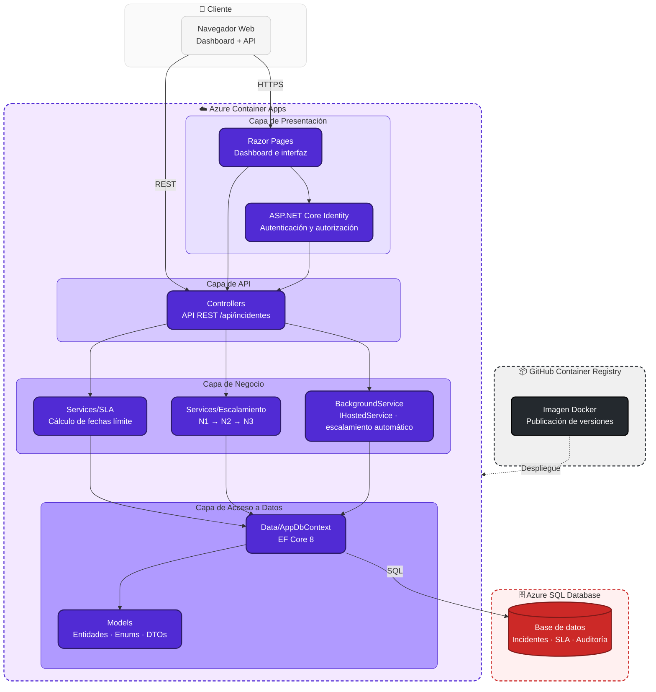

# Gestor de Incidentes TI (mini ITSM)


Proyecto de práctica en **ASP.NET Core 8 / C#**. Gestiona incidentes de soporte técnico con
prioridad, SLA, escalamiento automático N1 → N2 → N3 y trazabilidad completa de cada cambio
de estado.

> Nota: C# / .NET no forma parte de mis certificaciones formales actuales — este es un
> proyecto autodidacta para aplicar en código la experiencia real en gestión de incidentes,
> SLA e ITIL v4.

## Demo en vivo

**Aplicación:** [gestorincidentesti.livelywater-fe29fe0b.australiaeast.azurecontainerapps.io](https://gestorincidentesti.livelywater-fe29fe0b.australiaeast.azurecontainerapps.io/)

## Funcionalidades

- Registro de incidentes con categoría, prioridad y solicitante
- Cálculo automático de fecha límite según SLA definido por prioridad
- Escalamiento automático cuando se supera el umbral de tiempo de SLA (`BackgroundService`)
- Dashboard con incidentes abiertos, % de cumplimiento de SLA y SLA incumplidos
- Historial de auditoría por cada cambio de estado o nivel

## Stack

| Capa | Tecnología |
|---|---|
| Backend | ASP.NET Core 8 (Web API + Razor Pages) |
| ORM | Entity Framework Core 8 |
| Base de datos | SQL Server / Azure SQL |
| Background jobs | `IHostedService` (in-process, sin infraestructura extra) |

## Estructura

```
GestorIncidentesTI/
├── GestorIncidentesTI.sln
└── src/GestorIncidentesTI/
    ├── Controllers/       # API REST
    ├── Data/               # DbContext + seed de SLA
    ├── Models/             # Entidades, enums y DTOs
    ├── Pages/              # Dashboard (Razor Pages)
    ├── Services/           # Lógica de SLA y escalamiento
    └── Program.cs
```
## Arquitectura



## Correr localmente

1. Instala el [.NET 8 SDK](https://dotnet.microsoft.com/download) y SQL Server (o usa el
   contenedor: `docker run -e "ACCEPT_EULA=Y" -e "SA_PASSWORD=TuPasswordAqui" -p 1433:1433 -d mcr.microsoft.com/mssql/server:2022-latest`).
2. Copia `appsettings.Development.json.example` a `appsettings.Development.json` y pon tu
   connection string real ahí (ese archivo está en `.gitignore`, nunca se sube).
3. Restaura y aplica migraciones:
```bash
   cd src/GestorIncidentesTI
   dotnet restore
   dotnet ef migrations add InicialSchema
   dotnet ef database update
```
4. Corre la app:
```bash
   dotnet run
```
5. Dashboard en `https://localhost:5001`, API en `https://localhost:5001/api/incidentes`.

## Despliegue en Azure

La aplicación corre en **Azure Container Apps**, con la imagen publicada en GitHub Container
Registry, y la base de datos en Azure SQL Database (plan gratuito). La base de datos existente
no se recrea al iniciar la aplicación: las migraciones se aplican como un paso controlado antes
de publicar cada nueva versión. La migración `20260917000000_AgregarAuditoriaDeUsuarios` solo
agrega campos opcionales de auditoría y preserva los datos actuales.

1. Genera un script idempotente de migraciones y revísalo con el responsable de la base:
```bash
   dotnet ef migrations script --idempotent --output artifacts/migrations.sql
```
2. Aplica el script a Azure SQL usando una identidad de despliegue con permisos de esquema.
3. Construye y publica la imagen en GitHub Container Registry.
4. Actualiza la Container App con la nueva imagen, definiendo `ConnectionStrings__Default`,
   `AdminSeed__Email` y `AdminSeed__Password` como variables de entorno/secrets del servicio —
   no se guardan en el repositorio.
5. El flujo se automatiza con GitHub Actions usando OpenID Connect: el workflow
   `.github/workflows/deploy-azure.yml` toma sus identificadores desde variables protegidas
   de GitHub y no utiliza secretos de publicación.

## Datos de prueba

La aplicación ya cuenta con proyectos e incidentes de ejemplo para evaluar el flujo completo
sin necesidad de crear datos manualmente: distintos estados (abierto, en progreso, escalado,
resuelto, cerrado) y niveles de cumplimiento de SLA (a tiempo, en riesgo, vencido), repartidos
en proyectos temáticos de infraestructura y desarrollo (red, cloud, identidad, monitoreo,
facturación, entre otros).

Solo el rol **Admin** puede crear y administrar proyectos. Los usuarios con rol **Usuario**
quedan asociados a un proyecto específico y, desde ahí, registran, comentan y dan seguimiento
a sus propios incidentes.

## Estado y publicación en GitHub

- Identity y acceso por proyecto protegen API, dashboard y administración.
- Antes de publicar, lee [SECURITY.md](SECURITY.md) y ejecuta `git status` para comprobar
  que no se incluyen configuraciones locales, secretos, datos de prueba, `.vs`, `bin` u `obj`.
- Faltan pruebas automatizadas y notificaciones reales (correo/Teams); son el siguiente paso
  antes de liberar el producto a usuarios finales.

## Autor

**Luis Felipe Arias Carriazo**
[GitHub](https://github.com/lariasca1994) · [LinkedIn](https://linkedin.com/in/lfac1)