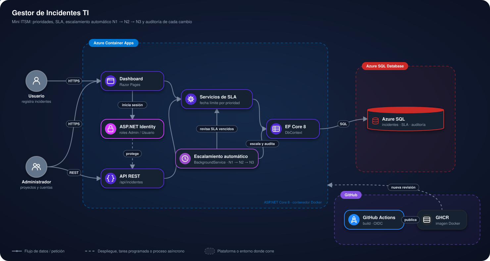

# Gestor de Incidentes TI (mini ITSM)

<p>
  <a href="https://gestorincidentesti.livelywater-fe29fe0b.australiaeast.azurecontainerapps.io/"></a>
  <a href="https://frontend-nine-topaz-99.vercel.app"></a>
  <a href="https://d4i3vsgw7xwmh.cloudfront.net"></a>
</p>


Proyecto de práctica en **ASP.NET Core 8 / C#**. Gestiona incidentes de soporte técnico con
prioridad, SLA, escalamiento automático N1 → N2 → N3 y trazabilidad completa de cada cambio
de estado.

### En pocas palabras

- **Qué hace:** es una mesa de ayuda. Alguien reporta una falla (un
  *incidente*), el sistema le asigna una fecha límite según su prioridad y, si
  nadie lo resuelve a tiempo, lo **escala solo** al siguiente nivel de soporte
  (N1 → N2 → N3).
- **Qué muestra:** un tablero con los incidentes abiertos, el porcentaje de
  cumplimiento de SLA y los vencidos, más el historial de cada cambio.
- **Cómo probarlo:** entra a la [demo](https://gestorincidentesti.livelywater-fe29fe0b.australiaeast.azurecontainerapps.io/),
  que ya trae incidentes de ejemplo. Para correrlo en tu equipo, ve a
  [Correr localmente](#correr-localmente).

> Nota: C# / .NET no forma parte de mis certificaciones formales actuales — este es un
> proyecto autodidacta para aplicar en código la experiencia real en gestión de incidentes,
> SLA e ITIL v4.

## Demo en vivo

**Aplicación:** [gestorincidentesti.livelywater-fe29fe0b.australiaeast.azurecontainerapps.io](https://gestorincidentesti.livelywater-fe29fe0b.australiaeast.azurecontainerapps.io/)

## Funcionalidades

- Registro de incidentes con categoría, prioridad y solicitante
- Cálculo automático de fecha límite según SLA definido por prioridad
- Escalamiento automático cuando se supera el umbral de tiempo de SLA (se evalúa al entrar al aplicativo)
- Avisos por correo al crear, resolver o cerrar incidentes y al crear proyectos
- Dashboard con incidentes abiertos, % de cumplimiento de SLA y SLA incumplidos
- Historial de auditoría por cada cambio de estado o nivel

## Stack

| Capa | Tecnología |
|---|---|
| Backend | ASP.NET Core 8 (Web API + Razor Pages) |
| ORM | Entity Framework Core 8 |
| Base de datos | SQL Server / Azure SQL |
| Escalamiento | Middleware bajo demanda (sin procesos en segundo plano que mantengan la base despierta) |
| Correo | API transaccional de Brevo (plan gratuito) |

## Estructura

```
GestorIncidentesTI/
├── GestorIncidentesTI.sln
└── src/GestorIncidentesTI/
    ├── Controllers/       # API REST
    ├── Data/               # DbContext + seed de SLA
    ├── Models/             # Entidades, enums y DTOs
    ├── Pages/              # Dashboard (Razor Pages)
    ├── Services/           # Lógica de SLA y escalamiento
    └── Program.cs
```
## Arquitectura

<p align="center">
  
</p>

- **Azure Container Apps** corre la aplicación ASP.NET Core 8: el dashboard
  (Razor Pages) y la API REST, ambos protegidos con ASP.NET Identity.
- Los **servicios de SLA** calculan la fecha límite de cada incidente. Los
  vencidos se revisan y escalan cuando alguien entra al aplicativo (como máximo
  cada 5 minutos), dejando registro en la auditoría; sin visitas no hay
  consultas y la base puede pausarse.
- **EF Core 8** guarda todo en **Azure SQL Database**.
- **GitHub Actions** construye la imagen, la publica en GHCR y actualiza la
  Container App (con OpenID Connect, sin secretos de publicación).

## Correr localmente

1. Instala el [.NET 8 SDK](https://dotnet.microsoft.com/download) y SQL Server (o usa el
   contenedor: `docker run -e "ACCEPT_EULA=Y" -e "SA_PASSWORD=TuPasswordAqui" -p 1433:1433 -d mcr.microsoft.com/mssql/server:2022-latest`).
2. Copia `appsettings.Development.json.example` a `appsettings.Development.json` y pon tu
   connection string real ahí (ese archivo está en `.gitignore`, nunca se sube).
3. Restaura y aplica migraciones:
```bash
   cd src/GestorIncidentesTI
   dotnet restore
   dotnet ef migrations add InicialSchema
   dotnet ef database update
```
4. Corre la app:
```bash
   dotnet run
```
5. Dashboard en `https://localhost:5001`, API en `https://localhost:5001/api/incidentes`.

## Despliegue en Azure

La aplicación corre en **Azure Container Apps**, con la imagen publicada en GitHub Container
Registry, y la base de datos en Azure SQL Database (plan gratuito). La base de datos existente
no se recrea al iniciar la aplicación: las migraciones se aplican como un paso controlado antes
de publicar cada nueva versión. La migración `20260917000000_AgregarAuditoriaDeUsuarios` solo
agrega campos opcionales de auditoría y preserva los datos actuales.

1. Genera un script idempotente de migraciones y revísalo con el responsable de la base:
```bash
   dotnet ef migrations script --idempotent --output artifacts/migrations.sql
```
2. Aplica el script a Azure SQL usando una identidad de despliegue con permisos de esquema.
3. Cada push a `main` dispara `.github/workflows/ghcr-publish.yml`: construye la imagen, la
   publica en GitHub Container Registry con la etiqueta del commit y actualiza la Container App.
   No hace falta redesplegar a mano. La autenticación con Azure usa OpenID Connect, sin
   secretos, con una identidad que solo puede actualizar esta Container App.
4. `ConnectionStrings__Default`, `AdminSeed__Email` y `AdminSeed__Password` viven como
   secrets de la Container App y no se guardan en el repositorio.

### Consumo de la capa gratuita

- **Container App** con `minReplicas: 0`, `maxReplicas: 1` y 0.25 vCPU / 0.5 GiB: sin
  visitas se apaga (unos 5 minutos después de la última petición) y no consume nada. La
  primera visita tarda unos segundos en arrancar.
- **Azure SQL sin servidor** (oferta gratuita, máximo 1 vCore): se pausa sola tras 60 minutos
  sin consultas, y si se agota la cuota del mes se pausa en vez de cobrar.
- La app solo consulta la base cuando alguien entra: al abrir el inicio de sesión o al
  navegar con sesión iniciada. Ahí siembra roles y admin (una vez por arranque) y evalúa los
  escalamientos de SLA (como máximo cada 5 minutos). La landing pública no toca la base, así
  que los bots y monitores no la despiertan.

## Datos de prueba

La aplicación ya cuenta con proyectos e incidentes de ejemplo para evaluar el flujo completo
sin necesidad de crear datos manualmente: distintos estados (abierto, en progreso, escalado,
resuelto, cerrado) y niveles de cumplimiento de SLA (a tiempo, en riesgo, vencido), repartidos
en proyectos temáticos de infraestructura y desarrollo (red, cloud, identidad, monitoreo,
facturación, entre otros).

## Usuarios y roles

- **Admin:** ve y gestiona todo, de todos los proyectos, y es el único que crea proyectos.
  Las cuentas Admin son fijas: se definen en los secrets `UsuariosAdmin__N__Email` /
  `UsuariosAdmin__N__Password` de la Container App, y la app las crea o repara (contraseña,
  rol, desbloqueo) cada vez que arranca y alguien entra. Son las únicas con rol Admin: si
  otra cuenta lo tuviera, pasa a Usuario. Una de ellas es la cuenta de pruebas automáticas
  (qa-evidencia).
- **Usuario:** se crea solo desde **Registrarme** (`/Identity/Account/Register`), eligiendo
  el proyecto al que pertenece. Desde ahí registra, comenta y da seguimiento a los incidentes
  de su proyecto.

## Avisos por correo y Telegram

Cada vez que se **crea un incidente**, se **resuelve o cierra** uno, o se **crea un
proyecto**, llega un correo a quien hizo la gestión y a los administradores
(`Notificaciones__Admins__N`). El correo usa la paleta del sitio, ordena los datos clave
(proyecto, estado, prioridad, nivel, SLA, quién lo gestionó) y muestra en **Notas** lo que
escribió el usuario: la descripción al crear y el comentario al resolver o cerrar.

Se envía con la API transaccional de **Brevo** (plan gratuito, 300 correos al día): la API
key va en el secret `Brevo__ApiKey` de la Container App y el remitente
(`Brevo__RemitenteEmail`) debe estar verificado en Brevo. Si el envío falla, la gestión se
guarda igual y el error queda en el log. Sin API key (por ejemplo, en local) solo se
registra en el log.

El mismo aviso llega también por **Telegram**, resumido y con un botón para abrir el
incidente, si están configurados `TELEGRAM_BOT_TOKEN` (secret) y `TELEGRAM_CHAT_ID`. Correo y
Telegram se envían por separado: si uno falla, el otro sale igual.

## Estado y publicación en GitHub

- Identity y acceso por proyecto protegen API, dashboard y administración.
- Antes de publicar, lee [SECURITY.md](SECURITY.md) y ejecuta `git status` para comprobar
  que no se incluyen configuraciones locales, secretos, datos de prueba, `.vs`, `bin` u `obj`.
- Las pruebas E2E corren en [qa-evidencia](https://d4i3vsgw7xwmh.cloudfront.net) de lunes a
  viernes a las 11:00 y 17:00 (hora Bogotá): hasta el 31 de octubre de 2026 solo en la de
  las 11:00, desde noviembre en ambas. Faltan pruebas unitarias.

## Autor

**Luis Felipe Arias Carriazo**
[GitHub](https://github.com/lariasca1994) · [LinkedIn](https://linkedin.com/in/lfac1)